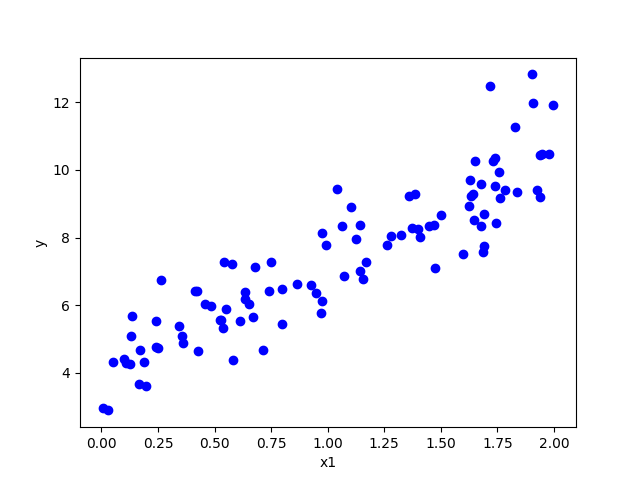

Ref. [精通機器學習 - 使用Scikit-Learn, Keras與TensorFlow. ver 2](https://www.tenlong.com.tw/products/9789865024345)


## section 4 訓練模型
<br>

### 線性回歸 (linear regression)]
<br>

先設定一線性回歸模型:  
$\hat{y} = \theta_{0}+\theta_{1}x_{1}+\theta_{2}x_{2}+...+\theta_{n}x_{n}$
<br>

此模型預測結果與真實數據的擬和誤差可以用RMSE計算, 另外求一 $\theta$讓模型誤差最小化時, 可改用MSE, 計算較簡單快速  
(可將函數最小化的值, 也可將函數的平方根最小化!)
<br>

$MSE(X,h_{\theta}) = \frac{1}{m}\sum_{i=1}^{m} {(\theta^{\mathrm T}x^{(i)}-y^{(i)})^2}$
<br>
<br>

**正規方程式求$\theta$**  
封閉式解決方案，可以直接用公式算出結果  
$$\hat{\theta} = (X^{\mathrm T}X)^{-1}X^{\mathrm T}y $$  
<br>

製作一些看起來線性的資料，用來測試方程式

```python
import numpy as np
x= 2* np.random.rand(100, 1)
y= 4+ 3* x+ np.random.randn(100, 1)
```

  
圖4-1 隨機產生的線性資料組

利用正規方程式計算 $\theta$ 發現與標準答案有落差 (來自noise干擾)

```python
theta_best= np.linalg.inv(x_b.T.dot(x_b)).dot(x_b.T).dot(y)
print(theta_best)

>>>
[[4.22146278]
 [2.80280021]]
```

以預測結果